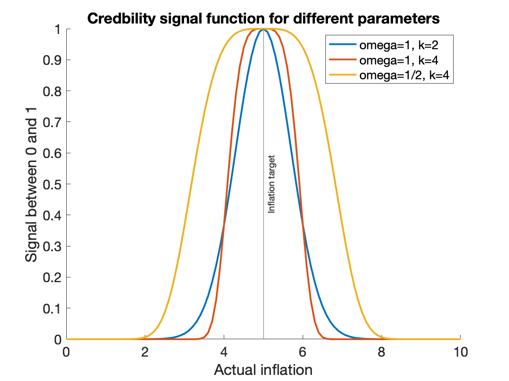

# Credibility Model

---

## Output gap

$$
y_t = \alpha \, y_{t-1} + (1-\alpha) \, y_{t+1} + \sigma \, 
\left( r_t - \pi_{t+1} - \rho \right) + \epsilon_{y,t}
$$

---

## Convex phillips curve

* The forward-lookingnes of the Phillips curve is determined by
  $\beta_t^\star\in(0,\,1)$, a discounting variable that moves endogenously with the
  level of credibility of the central bank

* If $\beta_t^\star$ is high (close to 1) then the weight on future
  expected inflation is high, and current inflation can be easily controlled by monetary policy instruments through the forward expectations channels

* If $\beta_t^\star$ is low (close to 0) then the weight on future
  expected inflation is low, current inflation is more strongly connected
  to its own past outcome, and hence its behaviour is more sluggish and
  persistent

$$ 
\pi_t - \pi_{t-1} = \beta_t^\star  \left( \pi_{t+1} -
\pi_t \right) + \gamma \tfrac{1}{\delta} \left( \exp\delta y_t - 1
\right) + \epsilon_{\pi, t}
$$

---

## Credibility-driven discounting

$$ 
\beta^\star_t = c_t \, \beta
$$

 

$$\beta\in(0,1)$$ fixed parameter

$$c_t\in(0,1)$$ time-varying (endogenous) credibility of CB

---

## Stock of credibility 

$$
c_t = \psi \, c_{t-1} + (1-\psi) \, s_t
$$

$s_t$ is a credibility update signal

---

## Credibility signal

$$
s_t = \exp \left[
    -\omega\,\left(
       \pi4_{t-1} - \pi^\mathrm{targ} 
    \right)^k
\right]
$$

where $omega>0$ and $k=\{2, 4, \dots\}$

---

## Credibility signal function for different parameters

---

## Monetary policy reaction function

$$
r_t^\mathrm{unc} = \theta\, r_{t-1} + (1-\theta) \left[
\rho + \pi^\mathrm{targ} + \kappa\left( \pi4_{t+3} - \pi^\mathrm{targ}
\right) \right] + \epsilon_{r,t}
$$

$$
r_t = \max \left( r_t^\mathrm{unc}, 0 \right)
$$

